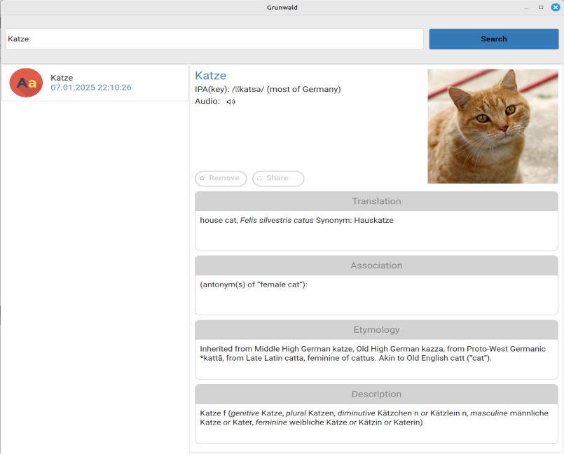

# grunwald

Qt qml German-English dictionary application.<br/>
The application searches online words with wiktionary REST API.


## Building
Perform the following actions for building project:

```bash
cmake --build build/debug --target clean
cmake --build build/debug --target all
```

## Third party libraries:
  * QGumboParser - html parser library <br/>
  * QCoro - coroutine library <br/>

## Requirements
C++20 <br/>
Qt 6 <br/>
